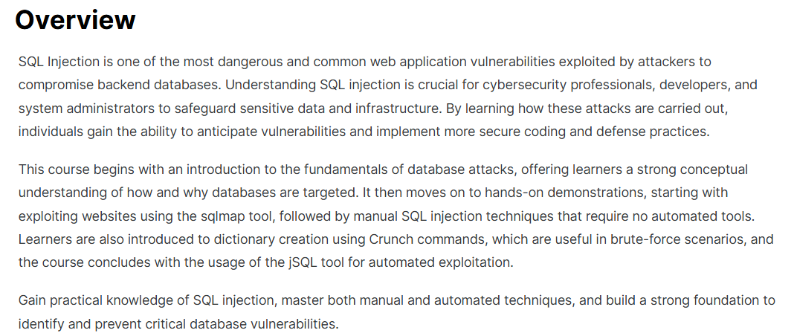
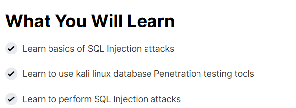

# 🛡️ SQL Injection Attacks – Continue Learning (EC-Council)

This repository contains **notes, practical exercises, case studies, references, and certificate of completion** for the *SQL Injection Attacks – Continue Learning (EC-Council)* program. The course provides an in-depth look at **SQL Injection techniques, exploitation paths, and mitigation strategies**.

---

## 📚 Notes
- 📄 [01-introduction.md](./notes/01-introduction.md) – Introduction to SQL Injection
- 📄 [02-sql-basics.md](./notes/02-sql-basics.md) – SQL fundamentals
- 📄 [03-classic-injection.md](./notes/03-classic-injection.md) – Classic SQLi
- 📄 [04-blind-injection.md](./notes/04-blind-injection.md) – Blind SQLi
- 📄 [05-error-based-injection.md](./notes/05-error-based-injection.md) – Error-based SQLi
- 📄 [06-time-based-injection.md](./notes/06-time-based-injection.md) – Time-based SQLi
- 📄 [07-advanced-techniques.md](./notes/07-advanced-techniques.md) – Advanced SQLi
- 📄 [08-prevention-mitigation.md](./notes/08-prevention-mitigation.md) – Prevention & mitigation

---

## 🧪 Practical
- ✅ [checklists.md](./practical/checklists.md) – Secure SQL coding checklist
- ⚔️ [red-team-labs.md](./practical/red-team-labs.md) – Red Team SQLi labs (controlled environments)
- 🛡️ [blue-team-defense.md](./practical/blue-team-defense.md) – Blue Team defense & detection

---

## 🔬 Research
- 📑 [case-studies.md](./extras/case-studies.md) – Real-world SQLi case studies
- 📆 [timeline.md](./extras/timeline.md) – SQLi historical timeline
- 📘 [resources.md](./extras/resources.md) – Recommended resources & further reading

---

## 📖 Docs
- 📘 [glossary.md](./docs/glossary.md) – SQLi glossary
- 📘 [index.md](./docs/index.md) – Program overview
- 📘 [references.md](./docs/references.md) – References & external sources
- 📘 [roadmap.md](./docs/roadmap.md) – Learning roadmap
- 📘 [syllabus.md](./docs/syllabus.md) – Course syllabus

---

## 📸 Screenshots

| Step | Screenshot |
|--------------------------|------------|
| 🏫 Course Overview |  |
| 📚 What You Will Learn |  |
| ⭐ Personal Review |  |

---

## 📜 Certificate
🎓 [SQL Injection Attacks – Continue Learning (EC-Council)](./cert/SQL%20Injection%20Attacks.png)

---

## 📝 Personal Review
This course deepened my understanding of **SQL Injection vulnerabilities** and their impact on web applications.  
The labs helped me distinguish between **classic, blind, error-based, and time-based SQLi techniques**, while the defensive modules reinforced best practices in **secure coding and blue-team detection**.  
It provides a strong foundation for learners who want to **strengthen web application security knowledge**.

---

## ✍️ Author
**Thành Danh** – Red Team Learner & Security Researcher  

- GitHub: [@ngvuthdanhh](https://github.com/ngvuthdanhh)  
- Email: ngvu.thdanh@gmail.com  

---

## 📄 License
This project is licensed under the terms of the **MIT License**. See [LICENSE](./LICENSE) for full details.  
© 2025 ngvuthdanhh. All rights reserved.  
